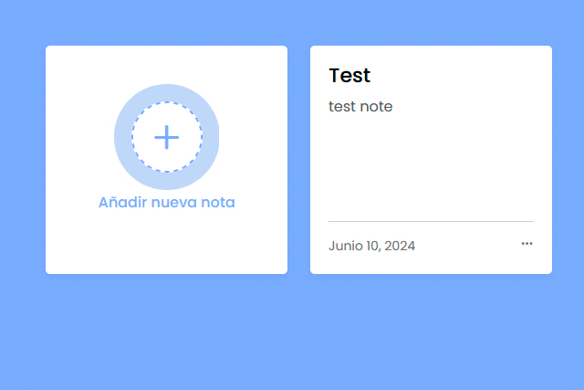

# Notes App

## URL

[Notes App Web](https://rodrisolisavila.github.io/notes/)

## Description

Welcome to our minimalist note-taking web application! This tool is designed for quick and efficient note capture, featuring a simple interface focused on titles and descriptions. Whether you're jotting down ideas, making reminders, or organizing thoughts, our application offers an easy-to-use solution to keep your notes accessible from anywhere.

## Features

- **Simple Interface:** Just enter a title and description for each note.
- **Efficient Organization:** Find your notes quickly with built-in search functionality.
- **Cross-Platform Access:** Access your notes from any device with an internet connection.
- **Privacy and Security:** Your data is kept safe and secure at all times.

## Getting Started

1. Clone the repository.
2. Open `index.html` in your preferred web browser.
3. Start creating and storing your notes!

## Feedback

We welcome any feedback or suggestions for improving our application. Feel free to [contact us](mailto:rodri.solis.avila@gmail.com) with your thoughts!
